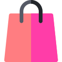

<h1 align="center">Shopping Bag</h1>

A robust session-based shopping bag for Laravel

    
    
    

<a href="https://github.com/laraware/docs/tree/main/shopping-bag">Go to documentation</a>

# Documentation

Documentation for Shopping Bag can be found in the [docs repository](https://github.com/laraware/docs/tree/main/shopping-bag).

# Changelog

See the [CHANGELOG](CHANGELOG.md) in this repository for all the recent changes.

# Maintainers

Shopping Bag is developed and maintained by [Laraware](https://github.com/laraware).

# License

Shopping Bag is open-sourced software licensed under the [MIT license](LICENSE.md).
